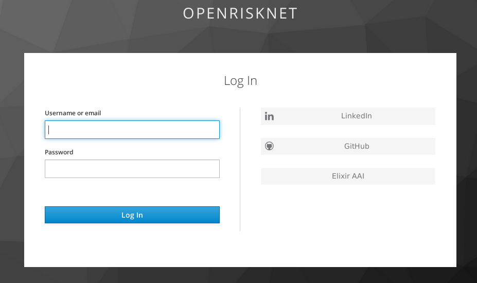

# NSC WGF FAIR maturity indicator analysis

Repository to coordinate the WGF task on the FAIR maturity indicator analyses of nanodatabases. The model
is inherited from this notebook, which can serve as example when decided what to fill out in the template:
https://github.com/sbonaretti/FAIR_metrics/blob/master/code/FAIR_assessment_2.ipynb

Planned telcons:

* WGF Tasks telcons: to be planned 

## Databases planned to be analyzed

* [eNanoMapper](https://data.enanomapper.net/): Nina + Laurent ([notebook](FAIR_assessment_eNanoMapperDB.ipynb))
* Korean database: Hyun (with help from Martine + Egon)
* NanoCommonsDB: Dieter + Egon
* [NECID](https://perosh.eu/research-projects/perosh-projects/necid/): Johannes?
* ACEnano: Thomas + Lucian?

## Jyputer notebooks

The maturity indicators will be calculated using the approach developed by Dr Bonaretti [0].

The [OpenRiskNet](https://openrisknet.org/) project provides a 
[free Jupyter notebook server](https://jupyter.prod.openrisknet.org/), so that you do not have to
install it locally. Logging in works with LinkedIn, GitHub, and ELIXIR accounts:

0.https://www.biorxiv.org/content/10.1101/739334v1
